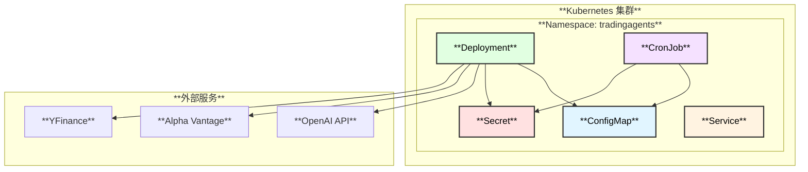
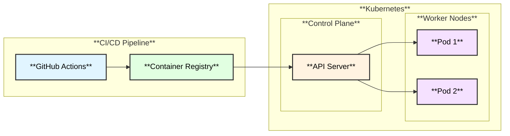

# TradingAgents Golang K8S 部署方案

## 概述

本文档详细介绍如何将 TradingAgents Golang 版本部署到 Kubernetes 集群。



---

## 1. 前置条件

### 1.1 环境要求

| 组件 | 版本要求 | 说明 |
|------|---------|------|
| **Kubernetes** | >= 1.25 | 支持 CronJob timeZone |
| **kubectl** | >= 1.25 | CLI 工具 |
| **Helm** | >= 3.0 | 可选，用于 Helm 部署 |
| **Docker** | >= 20.10 | 构建镜像 |

### 1.2 API Keys

需要以下 API Keys：
- **OPENAI_API_KEY**: OpenAI API 密钥（必需）
- **ALPHA_VANTAGE_API_KEY**: Alpha Vantage API 密钥（可选）

---

## 2. 部署架构



---

## 3. 快速开始

### 3.1 构建 Docker 镜像

```bash
cd agent

# 构建镜像
make docker-build

# 推送到 Registry（可选）
export DOCKER_REGISTRY=your-registry.io
make docker-push
```

### 3.2 使用 kubectl 部署

```bash
# 创建 Namespace
kubectl apply -f deploy/k8s/namespace.yaml

# 创建 ConfigMap
kubectl apply -f deploy/k8s/configmap.yaml

# 创建 Secret（先修改密钥）
kubectl apply -f deploy/k8s/secret.yaml

# 或者使用 kubectl 直接创建 Secret
kubectl create secret generic tradingagents-secrets \
  --namespace tradingagents \
  --from-literal=OPENAI_API_KEY=your-api-key \
  --from-literal=ALPHA_VANTAGE_API_KEY=your-av-key

# 部署应用
kubectl apply -f deploy/k8s/deployment.yaml
kubectl apply -f deploy/k8s/service.yaml

# 可选：部署 CronJob
kubectl apply -f deploy/k8s/cronjob.yaml
```

### 3.3 使用 Helm 部署

```bash
# 安装
helm install tradingagents ./deploy/helm/tradingagents \
  --namespace tradingagents \
  --create-namespace \
  --set secrets.openaiApiKey=your-api-key

# 升级
helm upgrade tradingagents ./deploy/helm/tradingagents \
  --namespace tradingagents

# 卸载
helm uninstall tradingagents --namespace tradingagents
```

### 3.4 使用 Makefile

```bash
# 一键部署
make k8s-deploy

# 查看状态
make k8s-status

# 查看日志
make k8s-logs

# 删除部署
make k8s-delete
```

---

## 4. 配置说明

### 4.1 ConfigMap 配置

```yaml
# deploy/k8s/configmap.yaml
data:
  LLM_PROVIDER: "openai"           # LLM 提供商
  DEEP_THINK_LLM: "o4-mini"        # 深度思考模型
  QUICK_THINK_LLM: "gpt-4o-mini"   # 快速思考模型
  MAX_DEBATE_ROUNDS: "1"           # 最大辩论轮数
  MAX_RISK_DISCUSS_ROUNDS: "1"     # 最大风险讨论轮数
  CORE_STOCK_APIS: "yfinance"      # 股票数据源
  TECHNICAL_INDICATORS: "yfinance" # 技术指标数据源
  FUNDAMENTAL_DATA: "alpha_vantage" # 基本面数据源
  NEWS_DATA: "alpha_vantage"       # 新闻数据源
```

### 4.2 Secret 配置

```yaml
# deploy/k8s/secret.yaml
stringData:
  OPENAI_API_KEY: "sk-..."
  ALPHA_VANTAGE_API_KEY: "..."
```

**生产环境建议：**
- 使用 [External Secrets Operator](https://external-secrets.io/)
- 使用 [Sealed Secrets](https://sealed-secrets.netlify.app/)
- 使用云提供商的密钥管理服务（AWS Secrets Manager, GCP Secret Manager, Azure Key Vault）

### 4.3 资源配置

```yaml
resources:
  requests:
    cpu: "100m"      # 最小 CPU
    memory: "256Mi"  # 最小内存
  limits:
    cpu: "500m"      # 最大 CPU
    memory: "512Mi"  # 最大内存
```

---

## 5. 部署模式

### 5.1 单次执行模式

适用于手动触发分析：

```yaml
# 使用 Job
apiVersion: batch/v1
kind: Job
metadata:
  name: tradingagents-analysis
spec:
  template:
    spec:
      containers:
        - name: tradingagents
          image: tradingagents:latest
          command: ["/app/tradingagents"]
          args: ["run", "--ticker", "NVDA", "--date", "2024-05-10"]
      restartPolicy: Never
```

### 5.2 定时执行模式

适用于每日自动分析：

```yaml
# 使用 CronJob
apiVersion: batch/v1
kind: CronJob
metadata:
  name: tradingagents-daily
spec:
  schedule: "0 14 * * 1-5"  # 工作日 UTC 14:00
  timeZone: "America/New_York"
```

### 5.3 API 服务模式

如果需要提供 API 服务（未来功能）：

```yaml
apiVersion: apps/v1
kind: Deployment
spec:
  replicas: 3
  template:
    spec:
      containers:
        - name: tradingagents
          command: ["/app/tradingagents"]
          args: ["serve", "--port", "8080"]
```

---

## 6. 监控与日志

### 6.1 查看日志

```bash
# 查看 Pod 日志
kubectl logs -f -l app.kubernetes.io/name=tradingagents -n tradingagents

# 查看 CronJob 日志
kubectl logs -f job/tradingagents-daily-xxx -n tradingagents
```

### 6.2 Prometheus 监控

```yaml
# 启用 ServiceMonitor（需要 Prometheus Operator）
metrics:
  enabled: true
  serviceMonitor:
    enabled: true
    interval: 30s
```

### 6.3 健康检查

```yaml
livenessProbe:
  exec:
    command: ["/app/tradingagents", "version"]
  initialDelaySeconds: 10
  periodSeconds: 30

readinessProbe:
  exec:
    command: ["/app/tradingagents", "version"]
  initialDelaySeconds: 5
  periodSeconds: 10
```

---

## 7. 高可用配置

### 7.1 Pod 反亲和性

```yaml
affinity:
  podAntiAffinity:
    preferredDuringSchedulingIgnoredDuringExecution:
      - weight: 100
        podAffinityTerm:
          labelSelector:
            matchLabels:
              app.kubernetes.io/name: tradingagents
          topologyKey: kubernetes.io/hostname
```

### 7.2 PodDisruptionBudget

```yaml
apiVersion: policy/v1
kind: PodDisruptionBudget
metadata:
  name: tradingagents-pdb
spec:
  minAvailable: 1
  selector:
    matchLabels:
      app.kubernetes.io/name: tradingagents
```

---

## 8. 安全配置

### 8.1 Pod 安全上下文

```yaml
securityContext:
  runAsNonRoot: true
  runAsUser: 1000
  runAsGroup: 1000
  fsGroup: 1000
```

### 8.2 容器安全上下文

```yaml
securityContext:
  allowPrivilegeEscalation: false
  readOnlyRootFilesystem: true
  capabilities:
    drop:
      - ALL
```

### 8.3 Network Policy

```yaml
apiVersion: networking.k8s.io/v1
kind: NetworkPolicy
metadata:
  name: tradingagents-policy
spec:
  podSelector:
    matchLabels:
      app.kubernetes.io/name: tradingagents
  policyTypes:
    - Egress
  egress:
    - to:
        - ipBlock:
            cidr: 0.0.0.0/0
      ports:
        - port: 443
          protocol: TCP
```

---

## 9. 故障排除

### 9.1 常见问题

| 问题 | 原因 | 解决方案 |
|------|------|---------|
| **Pod CrashLoopBackOff** | API Key 无效 | 检查 Secret 配置 |
| **ImagePullBackOff** | 镜像拉取失败 | 检查 Registry 权限 |
| **OOMKilled** | 内存不足 | 增加资源限制 |
| **Timeout** | 网络问题 | 检查网络策略 |

### 9.2 调试命令

```bash
# 查看 Pod 详情
kubectl describe pod -l app.kubernetes.io/name=tradingagents -n tradingagents

# 进入 Pod 调试
kubectl exec -it <pod-name> -n tradingagents -- /bin/sh

# 查看事件
kubectl get events -n tradingagents --sort-by='.lastTimestamp'
```

---

## 10. 生产环境清单

### 10.1 部署前检查

- [ ] API Keys 已配置并验证
- [ ] 资源限制已根据负载调整
- [ ] 监控和告警已配置
- [ ] 日志收集已配置
- [ ] 备份策略已制定
- [ ] 安全策略已审核

### 10.2 部署后验证

- [ ] Pod 运行正常
- [ ] 健康检查通过
- [ ] 日志输出正常
- [ ] 监控指标正常
- [ ] 测试执行成功

---

## 11. 参考资源

- [Kubernetes 官方文档](https://kubernetes.io/docs/)
- [Helm 官方文档](https://helm.sh/docs/)
- [External Secrets Operator](https://external-secrets.io/)
- [Prometheus Operator](https://prometheus-operator.dev/)
