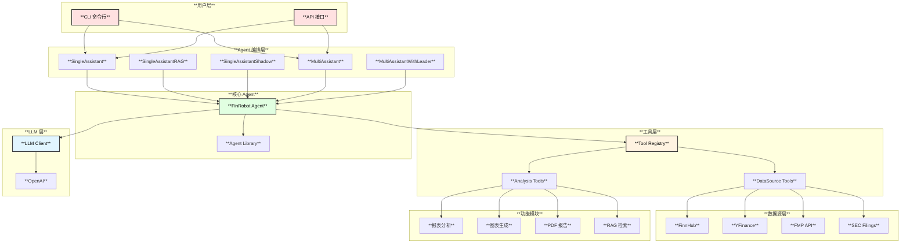
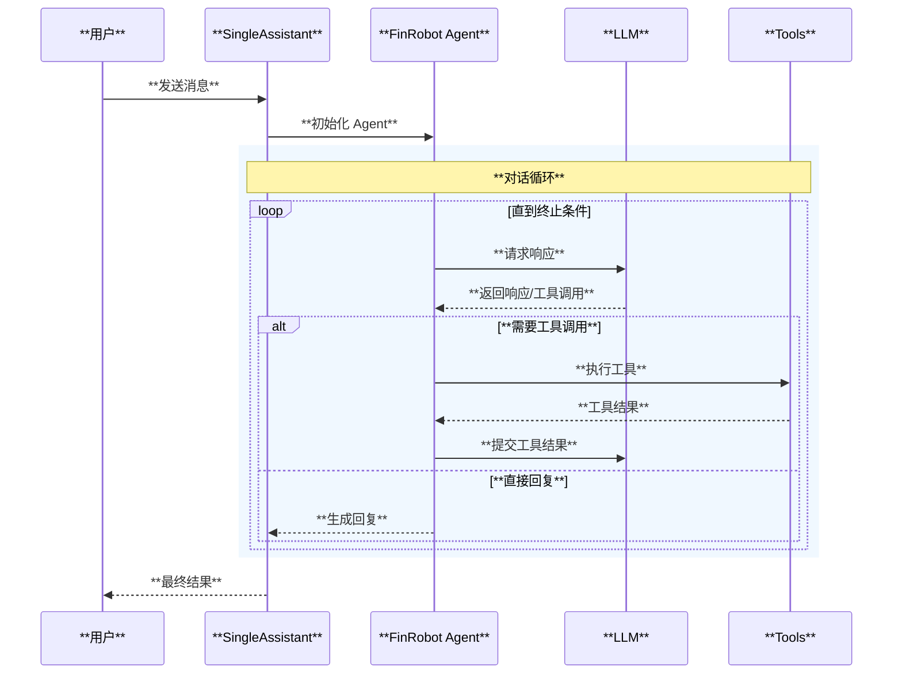
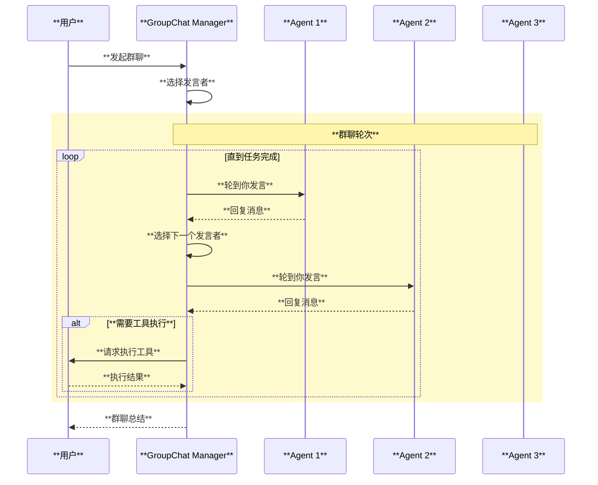
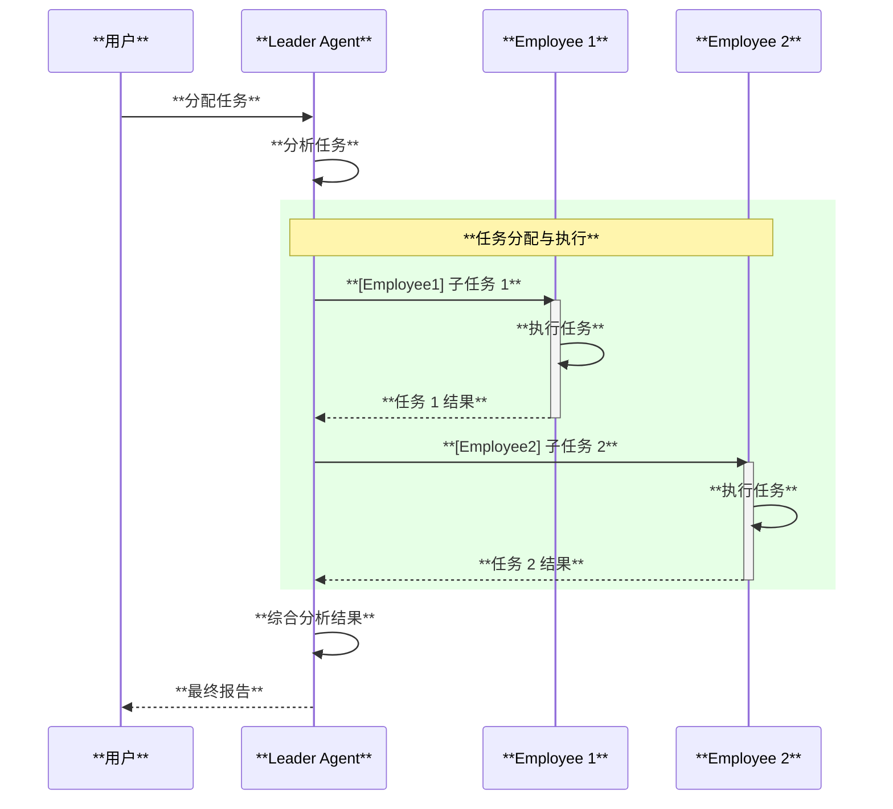
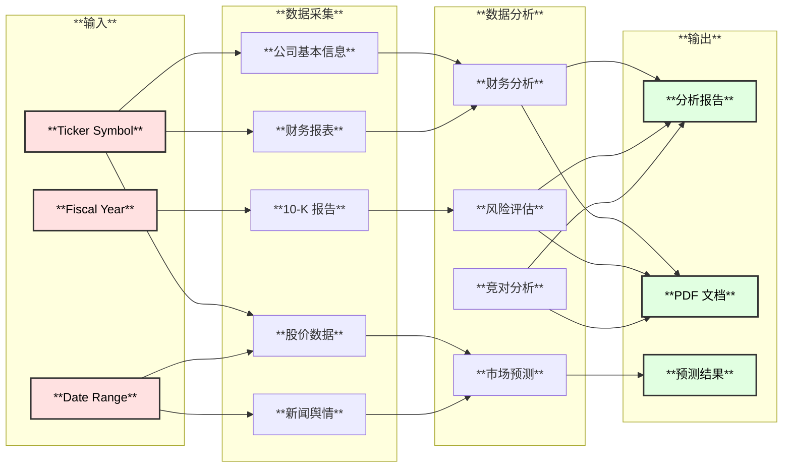
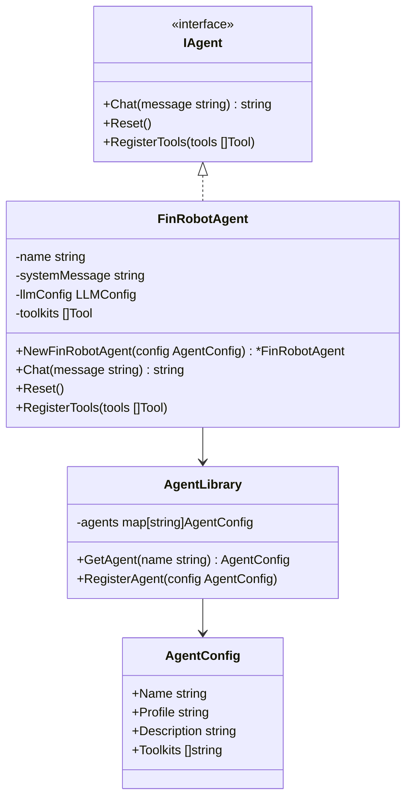
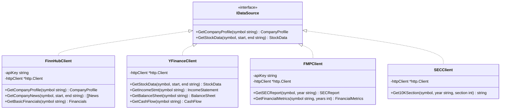
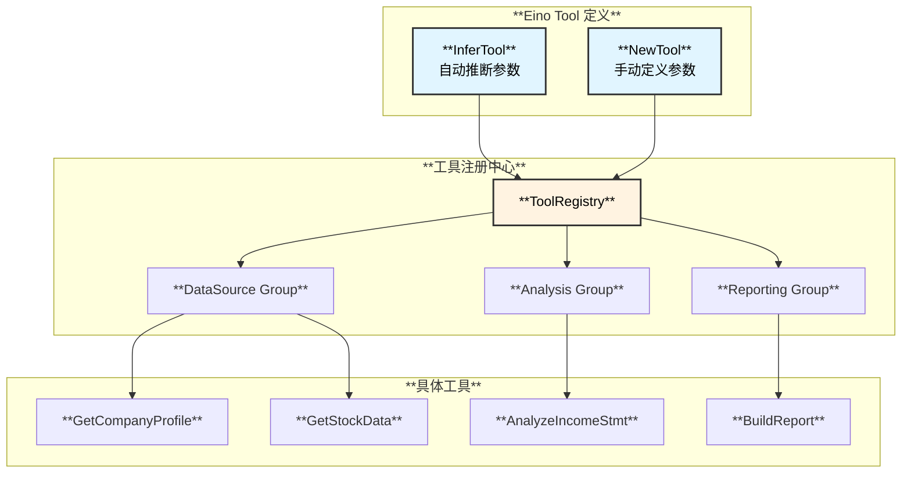
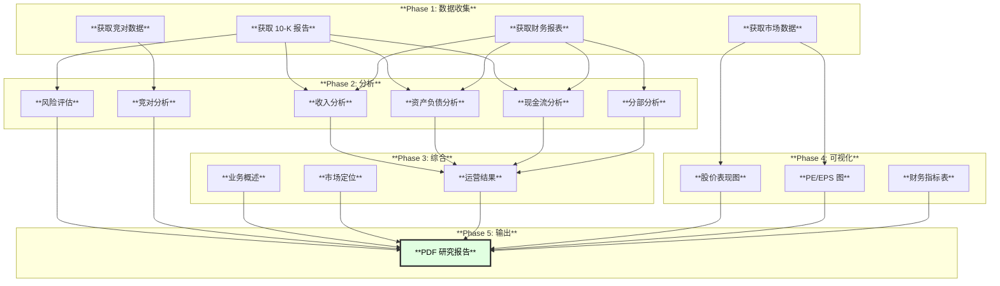

# FinRobot Golang 架构设计文档

> 基于 Eino 框架的金融 AI Agent 平台架构设计

---

## 1. 系统架构总览



---

## 2. Agent 工作流详解

### 2.1 SingleAssistant 工作流



### 2.2 MultiAssistant 群聊工作流



### 2.3 MultiAssistantWithLeader 工作流



---

## 3. 数据流架构



---

## 4. 类图设计

### 4.1 Agent 层类图



### 4.2 数据源层类图



---

## 5. 工具注册机制



### 5.1 InferTool 示例

```go
// 使用 struct tag 定义工具参数
type GetCompanyProfileParams struct {
    Symbol string `json:"symbol" jsonschema:"description=股票代码,example=AAPL"`
}

// 注册工具
tool, _ := utils.InferTool(
    "get_company_profile",
    "获取公司基本信息",
    func(ctx context.Context, params *GetCompanyProfileParams) (string, error) {
        return finnhub.GetCompanyProfile(params.Symbol)
    },
)
```

---

## 6. Equity Research Report 生成流程



---

## 7. 目录结构

```
TradingAgents/agent/finrobot/
│
├── cmd/
│   └── main.go                        # CLI 入口
│
├── internal/
│   ├── agents/
│   │   ├── finrobot.go                # 核心 Agent
│   │   ├── library.go                 # Agent 库
│   │   ├── prompts.go                 # 提示词模板
│   │   └── workflow/
│   │       ├── single.go              # SingleAssistant
│   │       ├── single_rag.go          # SingleAssistantRAG
│   │       ├── single_shadow.go       # SingleAssistantShadow
│   │       ├── multi.go               # MultiAssistant
│   │       └── multi_leader.go        # MultiAssistantWithLeader
│   │
│   ├── datasource/
│   │   ├── interface.go               # 数据源接口
│   │   ├── finnhub.go                 # FinnHub API
│   │   ├── yfinance.go                # YFinance API
│   │   ├── fmp.go                     # FMP API
│   │   └── sec.go                     # SEC Filings
│   │
│   ├── functional/
│   │   ├── analyzer.go                # 报表分析
│   │   ├── charting.go                # 图表生成
│   │   ├── reportlab.go               # PDF 生成
│   │   ├── text.go                    # 文本处理
│   │   └── rag.go                     # RAG 功能
│   │
│   ├── tools/
│   │   ├── registry.go                # 工具注册中心
│   │   ├── datasource_tools.go        # 数据源工具
│   │   └── analysis_tools.go          # 分析工具
│   │
│   ├── llm/
│   │   ├── client.go                  # LLM 客户端接口
│   │   └── openai.go                  # OpenAI 适配器
│   │
│   └── config/
│       └── config.go                  # 配置管理
│
├── pkg/
│   └── utils/
│       └── utils.go                   # 通用工具函数
│
├── go.mod
├── go.sum
└── README.md
```

---

## 8. 配置示例

```yaml
# config.yaml
llm:
  provider: openai
  model: gpt-4o
  api_key: ${OPENAI_API_KEY}
  base_url: https://api.openai.com/v1
  timeout: 120
  temperature: 0.5

api_keys:
  finnhub: ${FINNHUB_API_KEY}
  fmp: ${FMP_API_KEY}
  sec: ${SEC_API_KEY}

agent:
  default: Expert_Investor
  max_turns: 50
  human_input_mode: NEVER

output:
  work_dir: ./output
  report_dir: ./reports
```

---

## 9. 技术栈

| 组件 | 技术选型 | 说明 |
|------|----------|------|
| **Agent 框架** | CloudWeGo Eino | 字节开源 AI Agent 框架 |
| **LLM** | OpenAI GPT-4 | 主要 LLM 提供者 |
| **HTTP 客户端** | net/http + resty | API 调用 |
| **JSON 处理** | encoding/json | 数据序列化 |
| **图表生成** | go-echarts | 可视化图表 |
| **PDF 生成** | gofpdf / maroto | 报告输出 |
| **CLI** | cobra | 命令行界面 |
| **配置** | viper | 配置管理 |
| **日志** | zap / zerolog | 结构化日志 |

---

## 10. 关键设计决策

| 决策点 | 选择 | 理由 |
|--------|------|------|
| Agent 框架 | Eino | 官方支持，与 Golang 生态深度集成 |
| 工具定义方式 | InferTool | 减少样板代码，自动推断参数 |
| 数据源封装 | HTTP 封装 | 灵活性高，无需依赖第三方库 |
| 工作流编排 | Eino Workflow | 原生支持顺序/并行执行 |
| PDF 库 | gofpdf | 功能完整，社区活跃 |

---

*文档版本: v1.0*
*创建日期: 2026-01-31*
