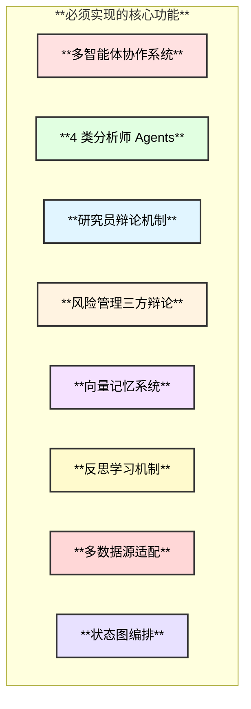
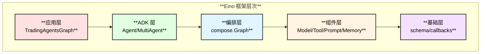
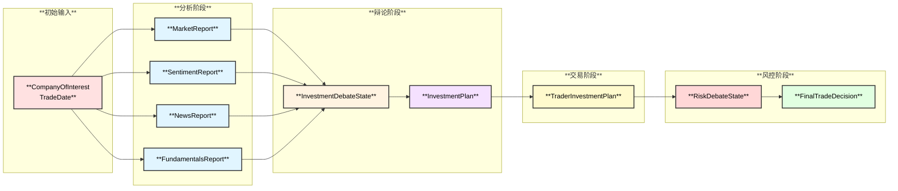
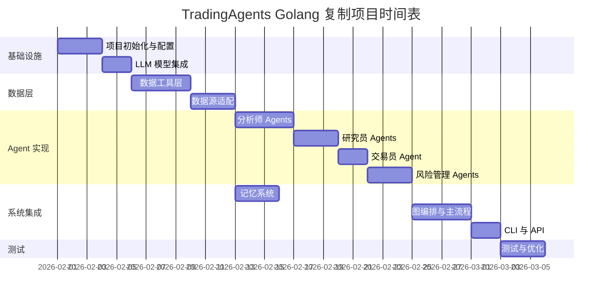

# Golang + Eino 框架复制 TradingAgents 开发规划

> 使用 CloudWeGo Eino 框架和 Golang 百分百复制 TradingAgents 多智能体金融交易框架

---

## 1. 项目概述

### 1.1 目标

将 Python 版本的 TradingAgents 完整迁移到 Golang，使用字节跳动开源的 **Eino** 框架作为多智能体编排基础，实现相同的功能和架构。

### 1.2 技术栈对比

| 原版 (Python) | Golang 版本 |
|--------------|-------------|
| **LangGraph** | **Eino ADK** (StateGraph 替代) |
| **LangChain** | **Eino** (Prompt/Tool/Chain) |
| **ChromaDB** | **Milvus / Qdrant / 内存向量** |
| **OpenAI SDK** | **Eino Model 抽象** |
| **yfinance** | **Go 金融数据 SDK** |
| **Alpha Vantage** | **HTTP Client 封装** |

### 1.3 核心功能清单



---

## 2. Eino 框架映射分析

### 2.1 核心概念映射

| TradingAgents (Python) | Eino (Golang) | 说明 |
|------------------------|---------------|------|
| `StateGraph` | `compose.Graph` | 状态图编排 |
| `ToolNode` | `tool.Definition` + `InvokableTool` | 工具节点 |
| `ChatPromptTemplate` | `prompt.ChatTemplate` | Prompt 模板 |
| `MessagesPlaceholder` | `schema.Message` 列表 | 消息占位 |
| `llm.bind_tools()` | `model.ChatModel` + Tool Binding | 工具绑定 |
| `workflow.add_node()` | `graph.AddNode()` | 添加节点 |
| `workflow.add_edge()` | `graph.AddEdge()` | 添加边 |
| `conditional_edges` | `graph.AddBranch()` | 条件分支 |

### 2.2 Eino 架构图



### 2.3 Eino 关键代码示例

```go
// 1. 定义工具
getStockData := tool.InvokableTool(
    tool.WithFunc(func(ctx context.Context, input *StockDataInput) (*StockDataOutput, error) {
        // 实现获取股票数据
        return fetchStockData(input.Symbol, input.StartDate, input.EndDate)
    }),
    tool.WithDescription("获取股票 OHLCV 数据"),
)

// 2. 创建 Agent
analyst := agent.NewChatModelAgent(ctx, &agent.ChatModelAgentConfig{
    Model: openaiModel,
    Tools: []tool.BaseTool{getStockData, getIndicators},
    SystemPrompt: "You are a market analyst...",
})

// 3. 编排多智能体图
graph := compose.NewGraph[*TradingState]()
graph.AddNode("market_analyst", marketAnalystNode)
graph.AddNode("bull_researcher", bullResearcherNode)
graph.AddEdge("market_analyst", "bull_researcher")
graph.AddBranch("bull_researcher", shouldContinueDebate)
```

---

## 3. 目录结构设计

```
TradingAgents/agent/
├── cmd/
│   └── main.go                    # 主入口
├── internal/
│   ├── agents/                    # Agent 实现
│   │   ├── analysts/
│   │   │   ├── market.go          # 技术分析师
│   │   │   ├── social.go          # 情绪分析师
│   │   │   ├── news.go            # 新闻分析师
│   │   │   └── fundamentals.go    # 基本面分析师
│   │   ├── researchers/
│   │   │   ├── bull.go            # 看涨研究员
│   │   │   └── bear.go            # 看跌研究员
│   │   ├── managers/
│   │   │   ├── research.go        # 研究经理
│   │   │   └── risk.go            # 风控经理
│   │   ├── risk_mgmt/
│   │   │   ├── aggressive.go      # 激进派
│   │   │   ├── neutral.go         # 中立派
│   │   │   └── conservative.go    # 保守派
│   │   └── trader/
│   │       └── trader.go          # 交易员
│   ├── graph/
│   │   ├── trading_graph.go       # 主图编排
│   │   ├── setup.go               # 图构建
│   │   ├── conditions.go          # 条件逻辑
│   │   ├── propagation.go         # 状态传播
│   │   └── reflection.go          # 反思学习
│   ├── dataflows/
│   │   ├── interface.go           # 数据源接口
│   │   ├── yfinance.go            # yfinance 适配
│   │   ├── alphavantage.go        # Alpha Vantage 适配
│   │   ├── googlenews.go          # Google News 适配
│   │   └── cache.go               # 数据缓存
│   ├── memory/
│   │   ├── vector_memory.go       # 向量记忆
│   │   └── embeddings.go          # Embedding 服务
│   ├── tools/
│   │   ├── stock.go               # 股票数据工具
│   │   ├── indicators.go          # 技术指标工具
│   │   ├── fundamentals.go        # 基本面工具
│   │   └── news.go                # 新闻工具
│   ├── states/
│   │   └── agent_state.go         # 状态定义
│   └── config/
│       └── config.go              # 配置管理
├── pkg/
│   └── utils/
│       └── helpers.go             # 公共工具
├── go.mod
├── go.sum
└── README.md
```

---

## 4. 状态定义设计

### 4.1 核心状态结构

```go
// internal/states/agent_state.go

package states

import "github.com/cloudwego/eino/schema"

// InvestDebateState 投资辩论状态
type InvestDebateState struct {
    BullHistory     string `json:"bull_history"`
    BearHistory     string `json:"bear_history"`
    History         string `json:"history"`
    CurrentResponse string `json:"current_response"`
    JudgeDecision   string `json:"judge_decision"`
    Count           int    `json:"count"`
}

// RiskDebateState 风险辩论状态
type RiskDebateState struct {
    RiskyHistory          string `json:"risky_history"`
    SafeHistory           string `json:"safe_history"`
    NeutralHistory        string `json:"neutral_history"`
    History               string `json:"history"`
    LatestSpeaker         string `json:"latest_speaker"`
    CurrentRiskyResponse  string `json:"current_risky_response"`
    CurrentSafeResponse   string `json:"current_safe_response"`
    CurrentNeutralResponse string `json:"current_neutral_response"`
    JudgeDecision         string `json:"judge_decision"`
    Count                 int    `json:"count"`
}

// AgentState 主状态
type AgentState struct {
    Messages          []schema.Message    `json:"messages"`
    CompanyOfInterest string              `json:"company_of_interest"`
    TradeDate         string              `json:"trade_date"`
    Sender            string              `json:"sender"`
    
    // 分析报告
    MarketReport       string `json:"market_report"`
    SentimentReport    string `json:"sentiment_report"`
    NewsReport         string `json:"news_report"`
    FundamentalsReport string `json:"fundamentals_report"`
    
    // 辩论状态
    InvestmentDebateState InvestDebateState `json:"investment_debate_state"`
    RiskDebateState       RiskDebateState   `json:"risk_debate_state"`
    
    // 决策结果
    InvestmentPlan       string `json:"investment_plan"`
    TraderInvestmentPlan string `json:"trader_investment_plan"`
    FinalTradeDecision   string `json:"final_trade_decision"`
}
```

### 4.2 状态流转图



---

## 5. 开发 ToDo 清单

### Phase 1: 项目基础设施 (预计 2-3 天)

| ID | 任务 | 优先级 | 依赖 | 状态 |
|----|------|--------|------|------|
| 1.1 | 初始化 Go Module，配置 go.mod | P0 | 无 | ⬜ |
| 1.2 | 引入 Eino 框架依赖 | P0 | 1.1 | ⬜ |
| 1.3 | 创建目录结构 | P0 | 1.1 | ⬜ |
| 1.4 | 实现配置管理 (config.go) | P0 | 1.3 | ⬜ |
| 1.5 | 实现日志系统 | P1 | 1.3 | ⬜ |
| 1.6 | 定义 AgentState 结构体 | P0 | 1.3 | ⬜ |

### Phase 2: LLM 模型集成 (预计 1-2 天)

| ID | 任务 | 优先级 | 依赖 | 状态 |
|----|------|--------|------|------|
| 2.1 | 封装 OpenAI ChatModel | P0 | 1.2 | ⬜ |
| 2.2 | 支持 deep_think_llm 配置 | P0 | 2.1 | ⬜ |
| 2.3 | 支持 quick_think_llm 配置 | P0 | 2.1 | ⬜ |
| 2.4 | 实现 Embedding 服务封装 | P0 | 2.1 | ⬜ |
| 2.5 | 支持多 LLM Provider (可选) | P2 | 2.1 | ⬜ |

### Phase 3: 数据工具层 (预计 3-4 天)

| ID | 任务 | 优先级 | 依赖 | 状态 |
|----|------|--------|------|------|
| 3.1 | 定义 Tool 接口规范 | P0 | 1.2 | ⬜ |
| 3.2 | 实现 get_stock_data 工具 | P0 | 3.1 | ⬜ |
| 3.3 | 实现 get_indicators 工具 | P0 | 3.1 | ⬜ |
| 3.4 | 实现 get_fundamentals 工具 | P0 | 3.1 | ⬜ |
| 3.5 | 实现 get_balance_sheet 工具 | P1 | 3.1 | ⬜ |
| 3.6 | 实现 get_cashflow 工具 | P1 | 3.1 | ⬜ |
| 3.7 | 实现 get_income_statement 工具 | P1 | 3.1 | ⬜ |
| 3.8 | 实现 get_news 工具 | P0 | 3.1 | ⬜ |
| 3.9 | 实现 get_global_news 工具 | P1 | 3.1 | ⬜ |
| 3.10 | 实现 get_insider_sentiment 工具 | P2 | 3.1 | ⬜ |
| 3.11 | 实现 get_insider_transactions 工具 | P2 | 3.1 | ⬜ |

### Phase 4: 数据源适配 (预计 2-3 天)

| ID | 任务 | 优先级 | 依赖 | 状态 |
|----|------|--------|------|------|
| 4.1 | 定义数据源接口 interface.go | P0 | 3.1 | ⬜ |
| 4.2 | 实现 yfinance 数据适配器 | P0 | 4.1 | ⬜ |
| 4.3 | 实现 Alpha Vantage 适配器 | P0 | 4.1 | ⬜ |
| 4.4 | 实现 Google News 适配器 | P1 | 4.1 | ⬜ |
| 4.5 | 实现数据缓存机制 | P1 | 4.1 | ⬜ |
| 4.6 | 实现数据源路由和 fallback | P1 | 4.2, 4.3 | ⬜ |

### Phase 5: 分析师 Agents (预计 3-4 天)

| ID | 任务 | 优先级 | 依赖 | 状态 |
|----|------|--------|------|------|
| 5.1 | 实现 MarketAnalyst Agent | P0 | 2.1, 3.2, 3.3 | ⬜ |
| 5.2 | 实现 SocialMediaAnalyst Agent | P0 | 2.1, 3.8 | ⬜ |
| 5.3 | 实现 NewsAnalyst Agent | P0 | 2.1, 3.8, 3.9 | ⬜ |
| 5.4 | 实现 FundamentalsAnalyst Agent | P0 | 2.1, 3.4-3.7 | ⬜ |
| 5.5 | 实现分析师工具节点 ToolNode | P0 | 5.1-5.4 | ⬜ |
| 5.6 | 实现消息清理节点 MsgClear | P1 | 5.1-5.4 | ⬜ |

### Phase 6: 研究员 Agents 与辩论 (预计 2-3 天)

| ID | 任务 | 优先级 | 依赖 | 状态 |
|----|------|--------|------|------|
| 6.1 | 实现 BullResearcher Agent | P0 | 2.1, 5.1-5.4 | ⬜ |
| 6.2 | 实现 BearResearcher Agent | P0 | 2.1, 5.1-5.4 | ⬜ |
| 6.3 | 实现 ResearchManager Agent | P0 | 6.1, 6.2 | ⬜ |
| 6.4 | 实现辩论轮次控制逻辑 | P0 | 6.1, 6.2 | ⬜ |
| 6.5 | 实现投资计划生成 | P0 | 6.3 | ⬜ |

### Phase 7: 交易员 Agent (预计 1-2 天)

| ID | 任务 | 优先级 | 依赖 | 状态 |
|----|------|--------|------|------|
| 7.1 | 实现 Trader Agent | P0 | 6.5 | ⬜ |
| 7.2 | 实现交易提案生成 | P0 | 7.1 | ⬜ |

### Phase 8: 风险管理 Agents (预计 2-3 天)

| ID | 任务 | 优先级 | 依赖 | 状态 |
|----|------|--------|------|------|
| 8.1 | 实现 RiskyDebator Agent | P0 | 7.2 | ⬜ |
| 8.2 | 实现 NeutralDebator Agent | P0 | 7.2 | ⬜ |
| 8.3 | 实现 SafeDebator Agent | P0 | 7.2 | ⬜ |
| 8.4 | 实现 RiskManager Agent | P0 | 8.1-8.3 | ⬜ |
| 8.5 | 实现风险辩论轮次控制 | P0 | 8.1-8.3 | ⬜ |
| 8.6 | 实现最终决策生成 | P0 | 8.4 | ⬜ |

### Phase 9: 记忆系统 (预计 2-3 天)

| ID | 任务 | 优先级 | 依赖 | 状态 |
|----|------|--------|------|------|
| 9.1 | 定义 Memory 接口 | P0 | 2.4 | ⬜ |
| 9.2 | 实现 FinancialSituationMemory | P0 | 9.1 | ⬜ |
| 9.3 | 集成向量数据库 (Milvus/内存) | P0 | 9.1 | ⬜ |
| 9.4 | 实现 add_situations 方法 | P0 | 9.2, 9.3 | ⬜ |
| 9.5 | 实现 get_memories 方法 | P0 | 9.2, 9.3 | ⬜ |
| 9.6 | 为各 Agent 集成记忆 | P0 | 9.4, 9.5 | ⬜ |

### Phase 10: 图编排与主流程 (预计 3-4 天)

| ID | 任务 | 优先级 | 依赖 | 状态 |
|----|------|--------|------|------|
| 10.1 | 实现 TradingAgentsGraph 主结构 | P0 | 5-8 | ⬜ |
| 10.2 | 实现 GraphSetup 图构建 | P0 | 10.1 | ⬜ |
| 10.3 | 实现 ConditionalLogic 条件逻辑 | P0 | 10.2 | ⬜ |
| 10.4 | 实现 Propagator 状态传播 | P0 | 10.2 | ⬜ |
| 10.5 | 实现 Reflector 反思学习 | P0 | 9.6, 10.2 | ⬜ |
| 10.6 | 实现 SignalProcessor 信号处理 | P0 | 10.4 | ⬜ |
| 10.7 | 实现完整工作流测试 | P0 | 10.1-10.6 | ⬜ |

### Phase 11: CLI 与 API (预计 1-2 天)

| ID | 任务 | 优先级 | 依赖 | 状态 |
|----|------|--------|------|------|
| 11.1 | 实现命令行入口 main.go | P0 | 10.7 | ⬜ |
| 11.2 | 实现 propagate 方法 | P0 | 10.7 | ⬜ |
| 11.3 | 实现 reflect_and_remember 方法 | P1 | 10.5 | ⬜ |
| 11.4 | 实现结果日志记录 | P1 | 11.2 | ⬜ |

### Phase 12: 测试与优化 (预计 2-3 天)

| ID | 任务 | 优先级 | 依赖 | 状态 |
|----|------|--------|------|------|
| 12.1 | 编写单元测试 | P1 | 11.2 | ⬜ |
| 12.2 | 编写集成测试 | P1 | 11.2 | ⬜ |
| 12.3 | 性能优化 | P2 | 12.1, 12.2 | ⬜ |
| 12.4 | 文档完善 | P1 | 12.1 | ⬜ |

---

## 6. 甘特图时间规划



---

## 7. 关键技术实现细节

### 7.1 Eino 图编排实现

```go
// internal/graph/trading_graph.go

package graph

import (
    "context"
    "github.com/cloudwego/eino/compose"
    "github.com/tradingagents/internal/states"
)

type TradingAgentsGraph struct {
    graph             *compose.Graph[*states.AgentState]
    deepThinkingLLM   model.ChatModel
    quickThinkingLLM  model.ChatModel
    bullMemory        *memory.FinancialSituationMemory
    bearMemory        *memory.FinancialSituationMemory
    traderMemory      *memory.FinancialSituationMemory
    config            *config.Config
}

func NewTradingAgentsGraph(ctx context.Context, cfg *config.Config) (*TradingAgentsGraph, error) {
    tag := &TradingAgentsGraph{
        config: cfg,
    }
    
    // 初始化 LLM
    tag.deepThinkingLLM = initLLM(cfg.DeepThinkLLM)
    tag.quickThinkingLLM = initLLM(cfg.QuickThinkLLM)
    
    // 初始化记忆
    tag.bullMemory = memory.NewFinancialSituationMemory("bull_memory", cfg)
    tag.bearMemory = memory.NewFinancialSituationMemory("bear_memory", cfg)
    tag.traderMemory = memory.NewFinancialSituationMemory("trader_memory", cfg)
    
    // 构建图
    tag.graph = tag.buildGraph(ctx)
    
    return tag, nil
}

func (t *TradingAgentsGraph) buildGraph(ctx context.Context) *compose.Graph[*states.AgentState] {
    graph := compose.NewGraph[*states.AgentState]()
    
    // 添加分析师节点
    graph.AddNode("market_analyst", t.createMarketAnalyst())
    graph.AddNode("social_analyst", t.createSocialAnalyst())
    graph.AddNode("news_analyst", t.createNewsAnalyst())
    graph.AddNode("fundamentals_analyst", t.createFundamentalsAnalyst())
    
    // 添加研究员节点
    graph.AddNode("bull_researcher", t.createBullResearcher())
    graph.AddNode("bear_researcher", t.createBearResearcher())
    graph.AddNode("research_manager", t.createResearchManager())
    
    // 添加交易员节点
    graph.AddNode("trader", t.createTrader())
    
    // 添加风控节点
    graph.AddNode("risky_analyst", t.createRiskyDebator())
    graph.AddNode("neutral_analyst", t.createNeutralDebator())
    graph.AddNode("safe_analyst", t.createSafeDebator())
    graph.AddNode("risk_judge", t.createRiskManager())
    
    // 添加边
    graph.AddEdge(compose.START, "market_analyst")
    graph.AddEdge("market_analyst", "social_analyst")
    graph.AddEdge("social_analyst", "news_analyst")
    graph.AddEdge("news_analyst", "fundamentals_analyst")
    graph.AddEdge("fundamentals_analyst", "bull_researcher")
    
    // 添加条件边
    graph.AddBranch("bull_researcher", t.shouldContinueDebate)
    graph.AddBranch("bear_researcher", t.shouldContinueDebate)
    
    graph.AddEdge("research_manager", "trader")
    graph.AddEdge("trader", "risky_analyst")
    
    graph.AddBranch("risky_analyst", t.shouldContinueRiskAnalysis)
    graph.AddBranch("safe_analyst", t.shouldContinueRiskAnalysis)
    graph.AddBranch("neutral_analyst", t.shouldContinueRiskAnalysis)
    
    graph.AddEdge("risk_judge", compose.END)
    
    return graph
}

func (t *TradingAgentsGraph) Propagate(ctx context.Context, company string, tradeDate string) (*states.AgentState, string, error) {
    initState := &states.AgentState{
        CompanyOfInterest: company,
        TradeDate:         tradeDate,
        InvestmentDebateState: states.InvestDebateState{Count: 0},
        RiskDebateState:       states.RiskDebateState{Count: 0},
    }
    
    finalState, err := t.graph.Invoke(ctx, initState)
    if err != nil {
        return nil, "", err
    }
    
    decision := t.processSignal(finalState.FinalTradeDecision)
    return finalState, decision, nil
}
```

### 7.2 分析师 Agent 实现

```go
// internal/agents/analysts/market.go

package analysts

import (
    "context"
    "github.com/cloudwego/eino/compose"
    "github.com/cloudwego/eino/schema"
)

func CreateMarketAnalyst(llm model.ChatModel, tools []tool.BaseTool) compose.NodeFunc[*states.AgentState] {
    return func(ctx context.Context, state *states.AgentState) (*states.AgentState, error) {
        systemPrompt := `You are a researcher tasked with analyzing market trends and 
technical indicators over the past week. Write a comprehensive report including 
OHLCV data analysis, technical indicators (MACD, RSI, moving averages), and 
provide insights that may help traders make decisions.

Make sure to append a Markdown table at the end of the report.`

        messages := []schema.Message{
            schema.SystemMessage(systemPrompt),
            schema.UserMessage(fmt.Sprintf(
                "Analyze %s as of %s",
                state.CompanyOfInterest,
                state.TradeDate,
            )),
        }
        
        // 绑定工具并调用
        resp, err := llm.Generate(ctx, messages, model.WithTools(tools))
        if err != nil {
            return nil, err
        }
        
        // 如果有工具调用，执行工具
        if len(resp.ToolCalls) > 0 {
            // 执行工具调用逻辑
            toolResults := executeTools(ctx, resp.ToolCalls, tools)
            messages = append(messages, schema.AssistantMessage(resp.Content))
            messages = append(messages, toolResults...)
            
            // 再次调用 LLM 生成报告
            resp, err = llm.Generate(ctx, messages)
            if err != nil {
                return nil, err
            }
        }
        
        state.MarketReport = resp.Content
        state.Messages = append(state.Messages, schema.AssistantMessage(resp.Content))
        
        return state, nil
    }
}
```

### 7.3 记忆系统实现

```go
// internal/memory/vector_memory.go

package memory

import (
    "context"
    "github.com/cloudwego/eino/components/embedding"
)

type FinancialSituationMemory struct {
    name       string
    embedder   embedding.Embedder
    collection VectorCollection
}

type MemoryRecord struct {
    Situation       string  `json:"situation"`
    Recommendation  string  `json:"recommendation"`
    SimilarityScore float64 `json:"similarity_score"`
}

func NewFinancialSituationMemory(name string, cfg *config.Config) *FinancialSituationMemory {
    embedder := openai.NewEmbedder(cfg.BackendURL, cfg.EmbeddingModel)
    collection := NewInMemoryCollection(name)
    
    return &FinancialSituationMemory{
        name:       name,
        embedder:   embedder,
        collection: collection,
    }
}

func (m *FinancialSituationMemory) AddSituations(ctx context.Context, situations []SituationAdvice) error {
    for _, sa := range situations {
        embedding, err := m.embedder.Embed(ctx, sa.Situation)
        if err != nil {
            return err
        }
        
        err = m.collection.Add(ctx, embedding, map[string]string{
            "situation":      sa.Situation,
            "recommendation": sa.Recommendation,
        })
        if err != nil {
            return err
        }
    }
    return nil
}

func (m *FinancialSituationMemory) GetMemories(ctx context.Context, currentSituation string, nMatches int) ([]MemoryRecord, error) {
    queryEmbedding, err := m.embedder.Embed(ctx, currentSituation)
    if err != nil {
        return nil, err
    }
    
    results, err := m.collection.Query(ctx, queryEmbedding, nMatches)
    if err != nil {
        return nil, err
    }
    
    records := make([]MemoryRecord, 0, len(results))
    for _, r := range results {
        records = append(records, MemoryRecord{
            Situation:       r.Metadata["situation"],
            Recommendation:  r.Metadata["recommendation"],
            SimilarityScore: 1 - r.Distance,
        })
    }
    
    return records, nil
}
```

---

## 8. 风险与挑战

### 8.1 技术风险

| 风险 | 影响 | 缓解措施 |
|------|------|---------|
| **Eino 框架文档不完善** | 高 | 参考官方示例，阅读源码 |
| **金融数据 API 限制** | 中 | 实现缓存机制，多数据源 fallback |
| **向量数据库选型** | 低 | 先用内存实现，后期可切换 |
| **LLM 调用成本** | 中 | 配置快/慢模型分级使用 |

### 8.2 依赖版本

```go
// go.mod 建议版本
module github.com/tradingagents/agent

go 1.21

require (
    github.com/cloudwego/eino v0.3.0
    github.com/cloudwego/eino-ext v0.2.0
)
```

---

## 9. 验收标准

### 9.1 功能验收

- [ ] 可以输入股票代码和日期，返回 BUY/SELL/HOLD 决策
- [ ] 4 类分析师能正确调用工具获取数据并生成报告
- [ ] 看涨/看跌研究员能进行多轮辩论
- [ ] 风险管理三方能进行多轮辩论
- [ ] 记忆系统能存储和检索相似经验
- [ ] 反思学习能根据结果更新记忆

### 9.2 性能指标

| 指标 | 目标值 |
|------|--------|
| 单次决策耗时 | < 120s |
| 内存占用 | < 500MB |
| 并发支持 | 5 个请求 |

---

## 10. 参考资源

- **Eino 官方文档**: https://cloudwego.io/zh/docs/eino/
- **Eino GitHub**: https://github.com/cloudwego/eino
- **Eino Examples**: https://github.com/cloudwego/eino-examples
- **原版 TradingAgents**: https://github.com/TauricResearch/TradingAgents
- **Alpha Vantage API**: https://www.alphavantage.co/documentation/

---

## 11. 下一步行动

1. **立即开始**: Phase 1 项目基础设施搭建
2. **并行准备**: 研究 Eino 框架 API 和示例代码
3. **数据准备**: 申请 Alpha Vantage API Key
4. **环境准备**: 配置 Go 开发环境和 OpenAI API

---

*文档版本: v1.0*
*创建时间: 2026-01-31*
*作者: AI Assistant*
