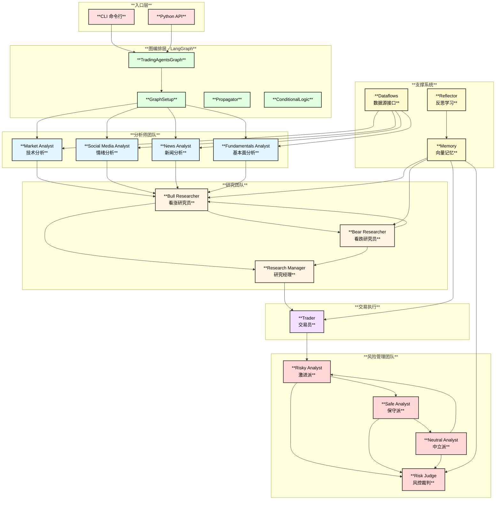
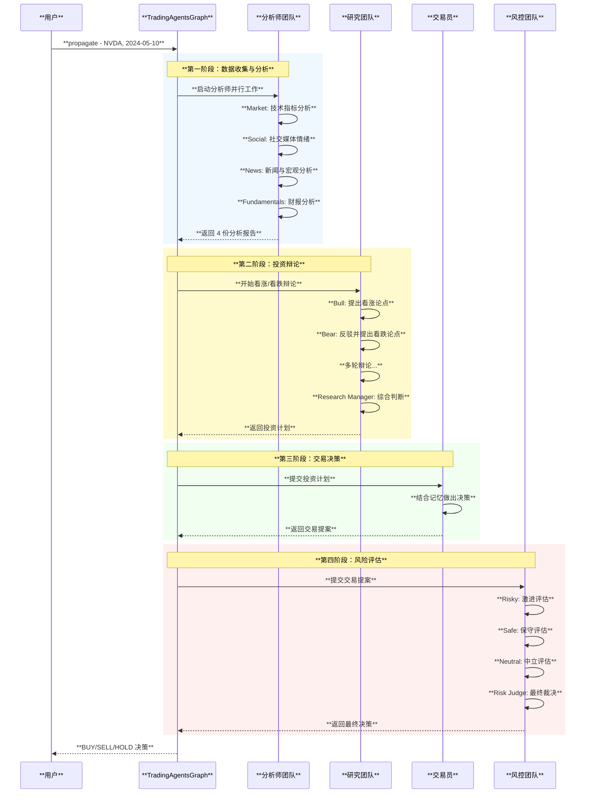
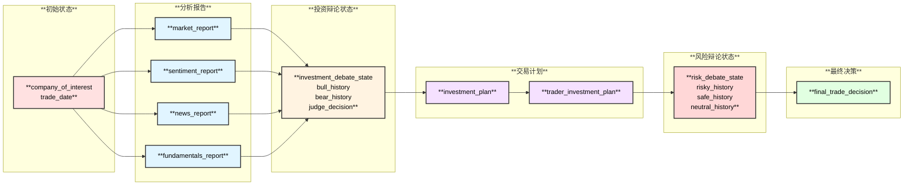
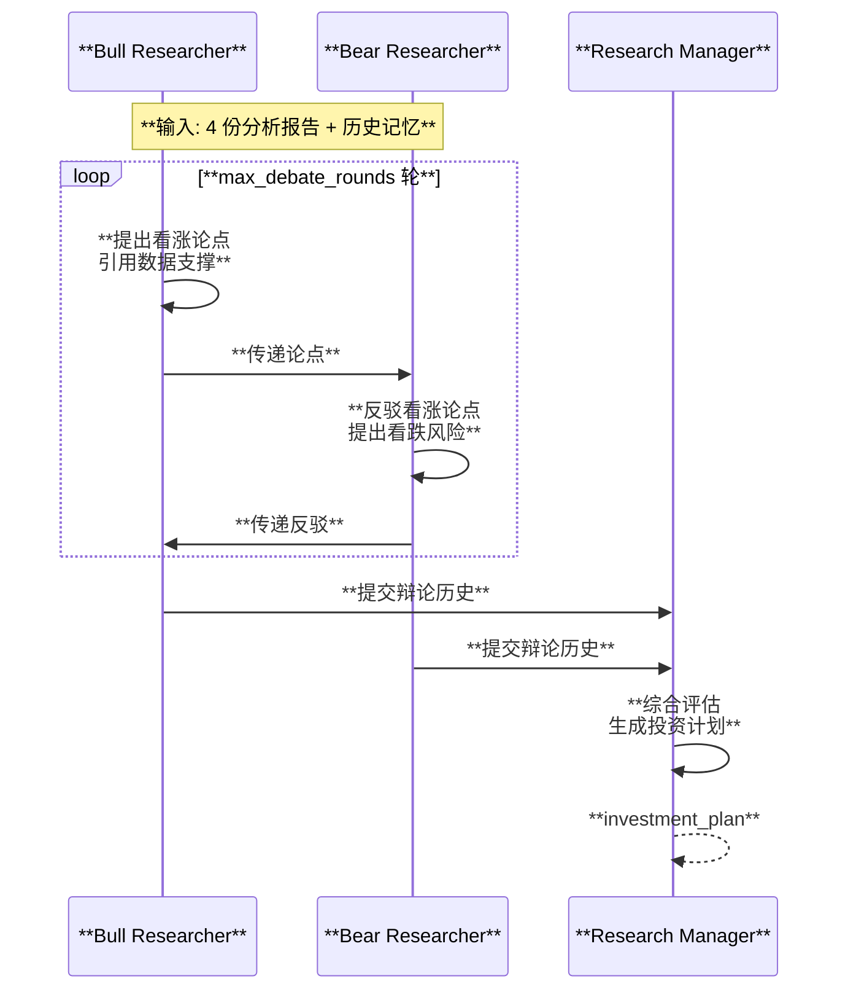
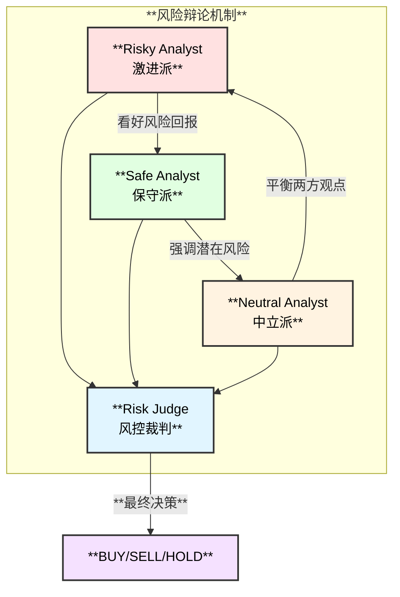
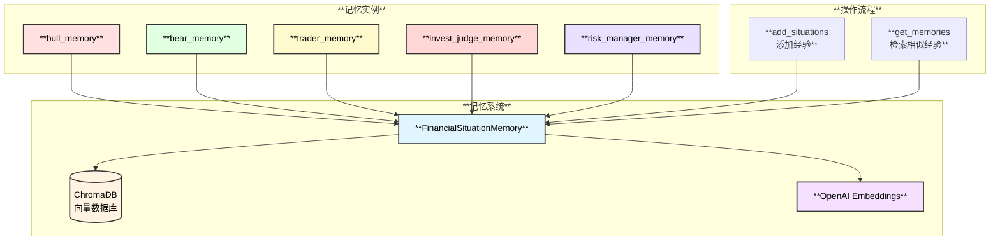
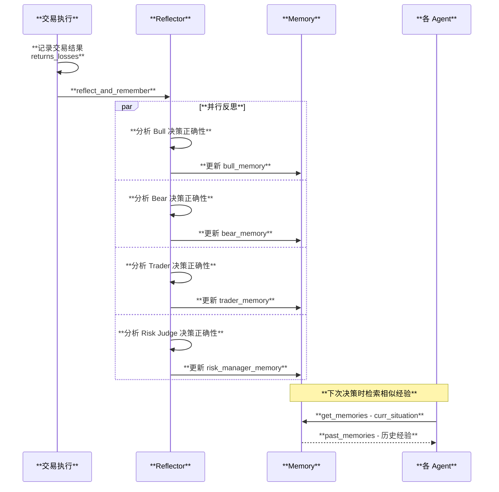
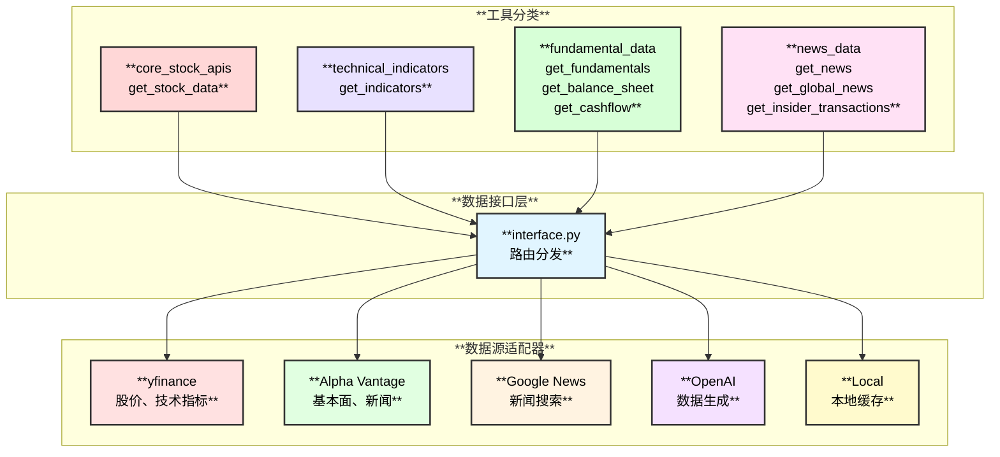

# TradingAgents 架构与实现分析

> TradingAgents 是一个基于 LLM 的多智能体金融交易框架，模拟真实交易公司的运作模式

---

## 1. 项目概述

### 1.1 核心定位

TradingAgents 是一个开源的多智能体金融交易框架，通过部署专业化的 LLM Agent（基本面分析师、情绪分析师、技术分析师、交易员、风险管理团队）协作评估市场状况并做出交易决策。

### 1.2 核心特性

| 特性 | 说明 |
|------|------|
| **多智能体协作** | 4 类分析师 + 研究团队 + 交易员 + 风控团队 |
| **辩论机制** | 看涨/看跌研究员辩论，风险三方辩论 |
| **记忆系统** | ChromaDB 向量记忆，支持经验学习 |
| **多数据源** | yfinance、Alpha Vantage、Google News、OpenAI |
| **可配置性** | LLM 提供商、辩论轮数、数据源均可配置 |

---

## 2. 整体架构

### 2.1 架构图



### 2.2 目录结构

```
TradingAgents/
├── tradingagents/
│   ├── agents/                    # Agent 实现
│   │   ├── analysts/              # 分析师 Agents
│   │   │   ├── fundamentals_analyst.py
│   │   │   ├── market_analyst.py
│   │   │   ├── news_analyst.py
│   │   │   └── social_media_analyst.py
│   │   ├── researchers/           # 研究员 Agents
│   │   │   ├── bull_researcher.py
│   │   │   └── bear_researcher.py
│   │   ├── trader/                # 交易员 Agent
│   │   │   └── trader.py
│   │   ├── managers/              # 管理者 Agents
│   │   │   ├── research_manager.py
│   │   │   └── risk_manager.py
│   │   ├── risk_mgmt/             # 风控辩论者
│   │   │   ├── aggresive_debator.py
│   │   │   ├── neutral_debator.py
│   │   │   └── conservative_debator.py
│   │   └── utils/                 # 工具和状态
│   │       ├── agent_states.py
│   │       ├── agent_utils.py
│   │       └── memory.py
│   ├── dataflows/                 # 数据源适配
│   │   ├── interface.py           # 路由接口
│   │   ├── y_finance.py           # yfinance 数据
│   │   ├── alpha_vantage*.py      # Alpha Vantage 数据
│   │   ├── google.py              # Google News
│   │   ├── openai.py              # OpenAI 数据生成
│   │   └── local.py               # 本地数据
│   ├── graph/                     # LangGraph 编排
│   │   ├── trading_graph.py       # 主入口
│   │   ├── setup.py               # 图构建
│   │   ├── propagation.py         # 状态传播
│   │   ├── reflection.py          # 反思学习
│   │   └── conditional_logic.py   # 条件逻辑
│   └── default_config.py          # 默认配置
├── cli/                           # CLI 入口
│   └── main.py
└── main.py                        # Python API 入口
```

---

## 3. 核心工作流程

### 3.1 完整交易决策流程



### 3.2 状态流转图



---

## 4. 核心模块详解

### 4.1 Agent 状态定义

```python
# tradingagents/agents/utils/agent_states.py

class AgentState(MessagesState):
    company_of_interest: str   # 交易标的
    trade_date: str            # 交易日期
    
    # 分析报告
    market_report: str         # 技术分析报告
    sentiment_report: str      # 情绪分析报告
    news_report: str           # 新闻分析报告
    fundamentals_report: str   # 基本面报告
    
    # 辩论状态
    investment_debate_state: InvestDebateState
    risk_debate_state: RiskDebateState
    
    # 决策结果
    investment_plan: str
    trader_investment_plan: str
    final_trade_decision: str
```

### 4.2 分析师团队

| 分析师 | 数据源 | 分析内容 |
|--------|--------|---------|
| **Market Analyst** | yfinance, Alpha Vantage | OHLCV、MACD、RSI、移动平均线等技术指标 |
| **Social Media Analyst** | News API | 社交媒体情绪、公众情绪评分 |
| **News Analyst** | Alpha Vantage, Google News | 全球新闻、宏观经济指标、内部人士动态 |
| **Fundamentals Analyst** | Alpha Vantage | 财务报表、资产负债表、现金流、收入 |

**分析师实现示例：**

```python
# tradingagents/agents/analysts/fundamentals_analyst.py

def create_fundamentals_analyst(llm):
    def fundamentals_analyst_node(state):
        tools = [
            get_fundamentals,
            get_balance_sheet,
            get_cashflow,
            get_income_statement,
        ]
        
        system_message = (
            "You are a researcher tasked with analyzing fundamental "
            "information about a company. Write a comprehensive report "
            "including financial documents, company profile, financials..."
        )
        
        prompt = ChatPromptTemplate.from_messages([
            ("system", "{system_message}"),
            MessagesPlaceholder(variable_name="messages"),
        ])
        
        chain = prompt | llm.bind_tools(tools)
        result = chain.invoke(state["messages"])
        
        return {
            "messages": [result],
            "fundamentals_report": result.content,
        }
    
    return fundamentals_analyst_node
```

### 4.3 研究员辩论机制



**看涨研究员核心逻辑：**

```python
# tradingagents/agents/researchers/bull_researcher.py

def create_bull_researcher(llm, memory):
    def bull_node(state) -> dict:
        # 获取分析报告
        market_report = state["market_report"]
        sentiment_report = state["sentiment_report"]
        news_report = state["news_report"]
        fundamentals_report = state["fundamentals_report"]
        
        # 从记忆中获取相似情境的经验
        curr_situation = f"{market_report}\n{sentiment_report}\n{news_report}\n{fundamentals_report}"
        past_memories = memory.get_memories(curr_situation, n_matches=2)
        
        prompt = f"""You are a Bull Analyst advocating for investing.
        
Key points to focus on:
- Growth Potential: Market opportunities, revenue projections
- Competitive Advantages: Unique products, strong branding
- Positive Indicators: Financial health, industry trends
- Bear Counterpoints: Address concerns with data

Resources: {market_report} {sentiment_report} {news_report} {fundamentals_report}
Past lessons: {past_memories}
Last bear argument: {current_response}
"""
        
        response = llm.invoke(prompt)
        return {"investment_debate_state": new_state}
    
    return bull_node
```

### 4.4 风险管理三方辩论



---

## 5. 记忆与学习系统

### 5.1 向量记忆架构



### 5.2 反思学习流程



**反思系统核心代码：**

```python
# tradingagents/graph/reflection.py

class Reflector:
    reflection_system_prompt = """
    You are an expert financial analyst reviewing trading decisions.
    
    1. Reasoning:
       - Determine if decision was correct (increased/decreased returns)
       - Analyze contributing factors: market intelligence, technical indicators,
         price movement, news, sentiment, fundamentals
    
    2. Improvement:
       - Propose revisions for incorrect decisions
       - Provide specific corrective actions
    
    3. Summary:
       - Summarize lessons learned
       - Highlight how to adapt for future scenarios
    """
    
    def reflect_bull_researcher(self, current_state, returns_losses, bull_memory):
        situation = self._extract_current_situation(current_state)
        bull_debate_history = current_state["investment_debate_state"]["bull_history"]
        
        result = self._reflect_on_component("BULL", bull_debate_history, situation, returns_losses)
        bull_memory.add_situations([(situation, result)])
```

---

## 6. 数据流系统

### 6.1 多数据源架构



### 6.2 数据源配置

```python
# tradingagents/default_config.py

DEFAULT_CONFIG = {
    # LLM 配置
    "llm_provider": "openai",
    "deep_think_llm": "o4-mini",      # 深度思考模型
    "quick_think_llm": "gpt-4o-mini", # 快速思考模型
    "backend_url": "https://api.openai.com/v1",
    
    # 辩论配置
    "max_debate_rounds": 1,           # 投资辩论轮数
    "max_risk_discuss_rounds": 1,     # 风险辩论轮数
    
    # 数据源配置
    "data_vendors": {
        "core_stock_apis": "yfinance",       # 股价数据
        "technical_indicators": "yfinance",  # 技术指标
        "fundamental_data": "alpha_vantage", # 基本面数据
        "news_data": "alpha_vantage",        # 新闻数据
    },
}
```

### 6.3 数据源路由机制

```python
# tradingagents/dataflows/interface.py

VENDOR_METHODS = {
    "get_stock_data": {
        "alpha_vantage": get_alpha_vantage_stock,
        "yfinance": get_YFin_data_online,
        "local": get_YFin_data,
    },
    "get_fundamentals": {
        "alpha_vantage": get_alpha_vantage_fundamentals,
        "openai": get_fundamentals_openai,
    },
    # ...
}

def route_to_vendor(method: str, *args, **kwargs):
    """路由到正确的数据源，支持自动 fallback"""
    category = get_category_for_method(method)
    primary_vendors = get_vendor(category, method)
    
    for vendor in fallback_vendors:
        try:
            result = VENDOR_METHODS[method][vendor](*args, **kwargs)
            return result
        except Exception:
            continue  # 尝试下一个数据源
```

---

## 7. LangGraph 图编排

### 7.1 图节点定义

```mermaid
graph TB
    subgraph "**LangGraph 工作流**"
        START((START))
        
        MA[**Market Analyst**]
        SA[**Social Analyst**]
        NA[**News Analyst**]
        FA[**Fundamentals Analyst**]
        
        TOOL_M[**tools_market**]
        TOOL_S[**tools_social**]
        TOOL_N[**tools_news**]
        TOOL_F[**tools_fundamentals**]
        
        CLR_M[**Msg Clear Market**]
        CLR_S[**Msg Clear Social**]
        CLR_N[**Msg Clear News**]
        CLR_F[**Msg Clear Fundamentals**]
        
        BULL[**Bull Researcher**]
        BEAR[**Bear Researcher**]
        RM[**Research Manager**]
        
        TRADER[**Trader**]
        
        RISKY[**Risky Analyst**]
        SAFE[**Safe Analyst**]
        NEUTRAL[**Neutral Analyst**]
        RJ[**Risk Judge**]
        
        END_NODE((END))
    end

    START --> MA
    MA -->|tool_calls| TOOL_M
    TOOL_M --> MA
    MA -->|done| CLR_M
    CLR_M --> SA
    
    SA -->|tool_calls| TOOL_S
    TOOL_S --> SA
    SA -->|done| CLR_S
    CLR_S --> NA
    
    NA -->|tool_calls| TOOL_N
    TOOL_N --> NA
    NA -->|done| CLR_N
    CLR_N --> FA
    
    FA -->|tool_calls| TOOL_F
    TOOL_F --> FA
    FA -->|done| CLR_F
    CLR_F --> BULL
    
    BULL -->|continue| BEAR
    BEAR -->|continue| BULL
    BULL -->|done| RM
    BEAR -->|done| RM
    
    RM --> TRADER
    TRADER --> RISKY
    
    RISKY -->|continue| SAFE
    SAFE -->|continue| NEUTRAL
    NEUTRAL -->|continue| RISKY
    RISKY -->|done| RJ
    SAFE -->|done| RJ
    NEUTRAL -->|done| RJ
    
    RJ --> END_NODE

    style START fill:#e1ffe1,stroke:#333,stroke-width:2px,color:#000
    style END_NODE fill:#ffe1e1,stroke:#333,stroke-width:2px,color:#000
    style MA fill:#e1f5ff,stroke:#333,stroke-width:2px,color:#000
    style SA fill:#e1f5ff,stroke:#333,stroke-width:2px,color:#000
    style NA fill:#e1f5ff,stroke:#333,stroke-width:2px,color:#000
    style FA fill:#e1f5ff,stroke:#333,stroke-width:2px,color:#000
    style BULL fill:#fff3e1,stroke:#333,stroke-width:2px,color:#000
    style BEAR fill:#fff3e1,stroke:#333,stroke-width:2px,color:#000
    style RM fill:#fff3e1,stroke:#333,stroke-width:2px,color:#000
    style TRADER fill:#f5e1ff,stroke:#333,stroke-width:2px,color:#000
    style RISKY fill:#ffd7d7,stroke:#333,stroke-width:2px,color:#000
    style SAFE fill:#ffd7d7,stroke:#333,stroke-width:2px,color:#000
    style NEUTRAL fill:#ffd7d7,stroke:#333,stroke-width:2px,color:#000
    style RJ fill:#ffd7d7,stroke:#333,stroke-width:2px,color:#000
```



### 7.2 条件边逻辑

```python
# tradingagents/graph/conditional_logic.py

class ConditionalLogic:
    def should_continue_market(self, state):
        """判断 Market Analyst 是否需要继续调用工具"""
        last_msg = state["messages"][-1]
        if last_msg.tool_calls:
            return "tools_market"
        return "Msg Clear Market"
    
    def should_continue_debate(self, state):
        """判断投资辩论是否继续"""
        debate_state = state["investment_debate_state"]
        if debate_state["count"] < self.config["max_debate_rounds"] * 2:
            if debate_state["current_response"].startswith("Bull"):
                return "Bear Researcher"
            return "Bull Researcher"
        return "Research Manager"
```

---

## 8. 使用指南

### 8.1 Python API 使用

```python
from tradingagents.graph.trading_graph import TradingAgentsGraph
from tradingagents.default_config import DEFAULT_CONFIG

# 创建配置
config = DEFAULT_CONFIG.copy()
config["deep_think_llm"] = "gpt-4o"
config["quick_think_llm"] = "gpt-4o-mini"
config["max_debate_rounds"] = 2

# 初始化交易图
ta = TradingAgentsGraph(debug=True, config=config)

# 执行交易决策
final_state, decision = ta.propagate("NVDA", "2024-05-10")
print(f"Decision: {decision}")  # BUY / SELL / HOLD

# 反思学习（可选）
actual_returns = 1000  # 实际收益
ta.reflect_and_remember(actual_returns)
```

### 8.2 CLI 使用

```bash
# 启动 CLI
python -m cli.main

# 选择：
# - Ticker: NVDA
# - Date: 2024-05-10
# - LLM: gpt-4o-mini
# - Debate Rounds: 1
```

### 8.3 自定义分析师

```python
# 只使用部分分析师
ta = TradingAgentsGraph(
    selected_analysts=["market", "fundamentals"],  # 仅技术 + 基本面
    debug=True,
    config=config
)
```

---

## 9. 技术亮点

### 9.1 设计亮点

| 亮点 | 说明 |
|------|------|
| **模拟真实交易公司** | 分析师团队 → 研究团队 → 交易员 → 风控，模拟真实决策流程 |
| **辩证决策** | 看涨/看跌辩论 + 风险三方辩论，避免单一视角偏见 |
| **记忆学习** | 向量记忆 + 反思机制，从历史决策中学习 |
| **多数据源** | 支持多种数据源，自动 fallback 机制 |
| **LangGraph 编排** | 灵活的状态图编排，支持条件分支和循环 |

### 9.2 与传统量化对比

| 对比项 | 传统量化 | TradingAgents |
|--------|---------|---------------|
| **决策方式** | 规则/模型驱动 | LLM 推理驱动 |
| **数据处理** | 结构化数据 | 结构化 + 非结构化 |
| **策略调整** | 人工调参 | 自动反思学习 |
| **可解释性** | 黑盒模型 | 自然语言解释 |
| **适应性** | 需重新训练 | 即时适应新信息 |

---

## 10. 参考资源

- **论文**: [TradingAgents: Multi-Agents LLM Financial Trading Framework](https://arxiv.org/abs/2412.20138)
- **GitHub**: https://github.com/TauricResearch/TradingAgents
- **LangGraph**: https://python.langchain.com/docs/langgraph
- **ChromaDB**: https://www.trychroma.com/
